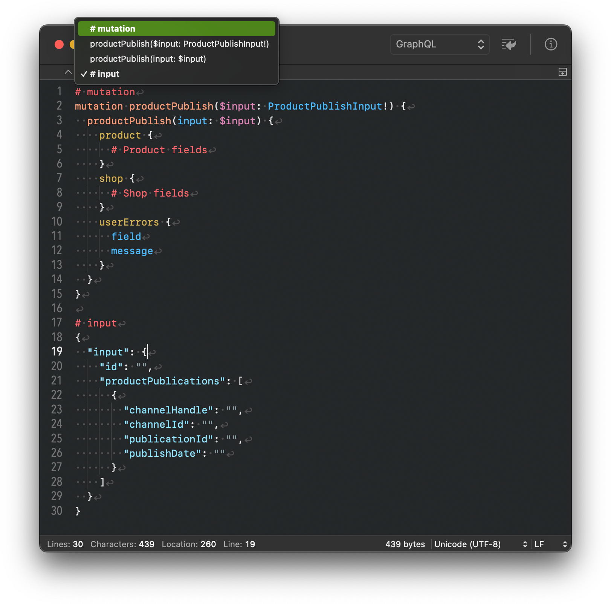
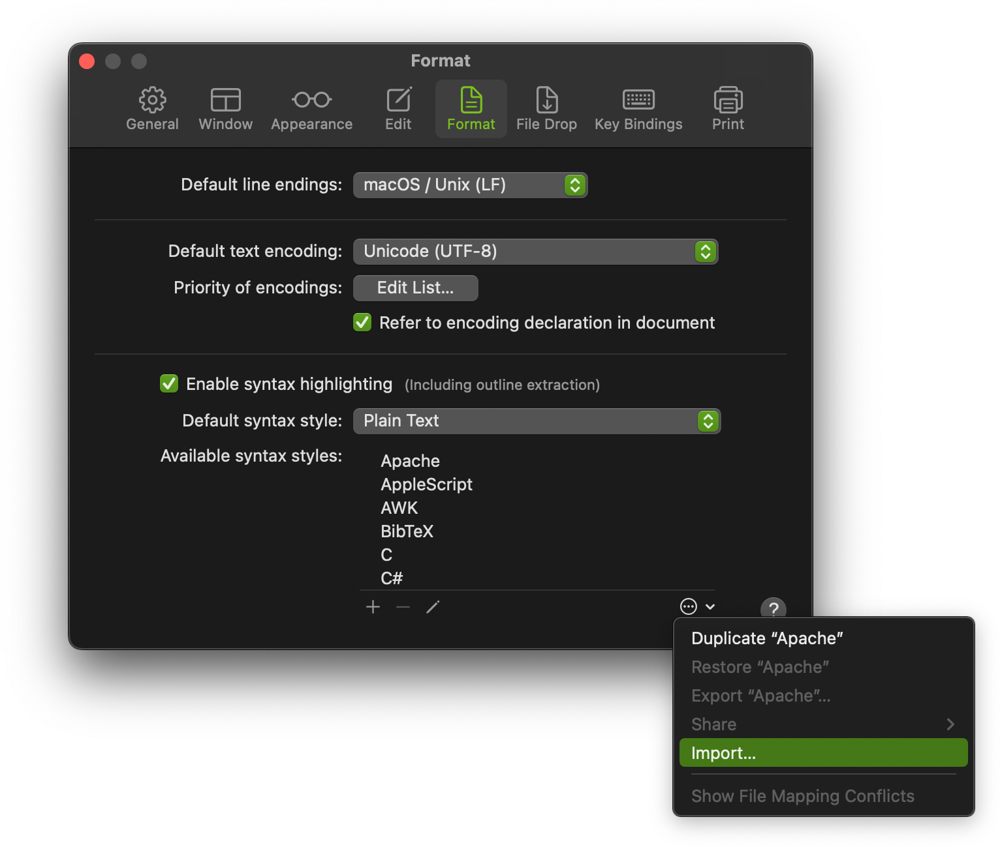

GraphQL syntax coloring for CotEditor
================

GraphQL Syntax coloring file for [CotEditor](https://coteditor.com/).



## Install

1. Download [latest release GraphQL.yml](https://github.com/hazi/graphql-syntax-coteditor/releases/latest/download/GraphQL.yml)
2. Select the CotEditor menu `Preference...`
3. Open the `Format` tab
4. Click the menu button in the `Available syntax styles` list and choose `Import...`
5. Select the downloaded `GraphQL.yml` file



## Contributing

* Fork a repository and create a pull request based on a branch in that repository.
* Be sure to run `. /normalizer` before committing.

### normalizer

Run normalizer in the Terminal before committing.

The normalizer sorts the order of the output files because the order of the output files changes each time they are exported from CotEditor, making it difficult to understand the differences.

```
$ ./normalizer
```

The pre-executed file is saved as `GraphQL.yml.back` and the normalized file is saved as `GraphQL.yml`.

Do not commit `GraphQL.yml.back` file.

## License

Licensed under the [BSD 3-Clause License](./LICENSE).
